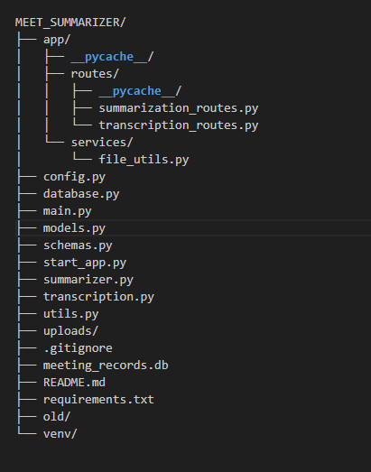

# Meet Summarizer: Local LLM-Powered Meeting Analysis

This project is a powerful, local-first application designed to convert raw meeting audio into structured, actionable insights. By leveraging highly efficient, open-source Large Language Models (LLMs) running entirely on your personal computer, it offers a completely free, private, and customizable solution for meeting summarization.

The application uses **FastAPI** to provide a robust, high-performance API backend that orchestrates the two-step workflow: **Transcription** (Audio-to-Text) and **Summarization** (Text-to-Structured-JSON).

## Table of Contents

- [Technologies Used](#technologies-used)
- [FastAPI: Why a Dedicated API?](#fastapi-why-a-dedicated-api)
- [Features](#features)
- [Installation](#installation)
- [Local LLM Setup](#local-llm-setup)
- [Usage](#usage)
- [Project Structure](#project-structure)
- [Contributing](#contributing)
- [License](#license)

---

## Technologies Used

- **Python**: The core programming language for the entire application logic.
- **FastAPI**: The modern, high-performance web framework used to build the API endpoints (routes).
- **Pydantic**: Integrated with FastAPI for data validation, ensuring clean and type-safe input/output models (schemas).
- **Ollama**: The framework used to download, serve, and interact with open-source LLMs locally.
- **`ollama` Python Library**: Used to communicate with the local Ollama API for both transcription and summarization.
- **Whisper**: The state-of-the-art open-source model used for highly accurate Audio-to-Text **Transcription**.
- **Phi-3 Mini / Mistral 7B / Llama 3 8B**: Lightweight LLMs used for complex **Summarization** and structured data extraction.
- **SQLite**: Used via the `meet_summarizer.db` file for persistent storage of meeting data (transcripts, summaries).

---

## FastAPI: Why a Dedicated API?

While a simple application could be built with a frontend-focused tool like Streamlit, using **FastAPI** for the backend offers significant advantages, especially for production-ready, scalable AI services:

1.  **High Performance (ASGI)**: FastAPI is one of the fastest Python frameworks, built on Starlette and Uvicorn, which use the ASGI standard for asynchronous operations. This is crucial for I/O-bound tasks like handling file uploads and waiting for LLM responses.
2.  **Automatic Documentation**: It automatically generates interactive API documentation (using **Swagger UI** and **ReDoc**) from the code, making it easy to test endpoints and for a separate frontend (like a web app or mobile client) to integrate.
3.  **Built-in Data Validation**: It leverages **Pydantic** models (defined in `schemas.py`) to enforce data types and validate input/output automatically, significantly reducing bugs and improving API reliability.
4.  **Clear Structure and Separation of Concerns**: The structure separates API routing (`app/routes/`) from business logic (`summarizer.py`, `transcription.py`) and database models (`models.py`), making the project easier to maintain, test, and scale.

---

## Features

- **End-to-End Local Processing**: All transcription and summarization is performed on your machine, ensuring data privacy and no external API costs.
- **Robust API Backend**: Implemented with **FastAPI** for reliable, asynchronous handling of requests.
- **Structured JSON Output**: Extracts specific data points like **Summary**, **Action Items**, and **New Requirements** based on `schemas.py`.
- **Persistent Storage**: Uses a local **SQLite** database (`meet_summarizer.db`) to store meeting metadata and summaries.
- **Modular Code**: Separates database models (`models.py`), Pydantic schemas (`schemas.py`), core logic, and API routes for professional development standards.

---

## Installation

To set up the project locally, follow these steps:

1.  **Clone the repository:**
    ```bash
    git clone <repository-url>
    ```

2.  **Navigate to the project directory:**
    ```bash
    cd MEET_SUMMARIZER
    ```

3.  **Create and activate a virtual environment:**
    ```bash
    python -m venv venv
    source venv/bin/activate  # macOS/Linux
    .\venv\Scripts\activate   # Windows
    ```

4.  **Install the required Python packages:**
    ```bash
    pip install -r requirements.txt
    ```
    *(Note: `requirements.txt` should contain `fastapi`, `uvicorn`, `ollama`, `pydantic`, `SQLAlchemy`, etc.)*

---

## Local LLM Setup

The application requires the Ollama server to be running with the necessary models downloaded.

1.  **Install Ollama:** Download and install the Ollama application from [ollama.com](https://ollama.com/).
2.  **Pull Required Models:** Use your terminal to download the Transcription and Summarization models.

    | Role | Model | Command |
    | :--- | :--- | :--- |
    | **Transcription** | Whisper | `ollama pull whisper` |
    | **Summarization** | Phi-3 Mini (Recommended) | `ollama pull phi3` |

3.  **Ensure Ollama is Running:** Verify the Ollama server is active in the background before running the FastAPI application.

---

## Usage

The application is run as an API server using Uvicorn.

1.  **Start the Database and Application:**
    *The `start_app.py` script should handle initializing the database (creating tables based on `models.py`) and then running the FastAPI application.*
    ```bash
    python start_app.py
    ```
2.  **Access Documentation:**
    *The API will be available at `http://127.0.0.1:8000`. You can view the interactive documentation to test endpoints at:*
    ```
    [http://127.0.0.1:8000/docs](http://127.0.0.1:8000/docs)
    ```
3.  **API Endpoints:**
    * **`POST /api/v1/transcribe`**: Uploads an audio file and returns the raw transcript.
    * **`POST /api/v1/summarize/{transcript_id}`**: Takes the transcript and returns the structured JSON summary, saving the results to the database.

---

## Project Structure

This structure separates concerns into distinct layers (API, Services, Data Models) for maintainability, which is a key best practice for a scalable **FastAPI** application.

## Project Structure




## Contributing

Contributions are welcome! Please submit a pull request or open an issue for any enhancements.

---

## License

This project is licensed under the MIT License - see the [LICENSE](LICENSE) file for details.